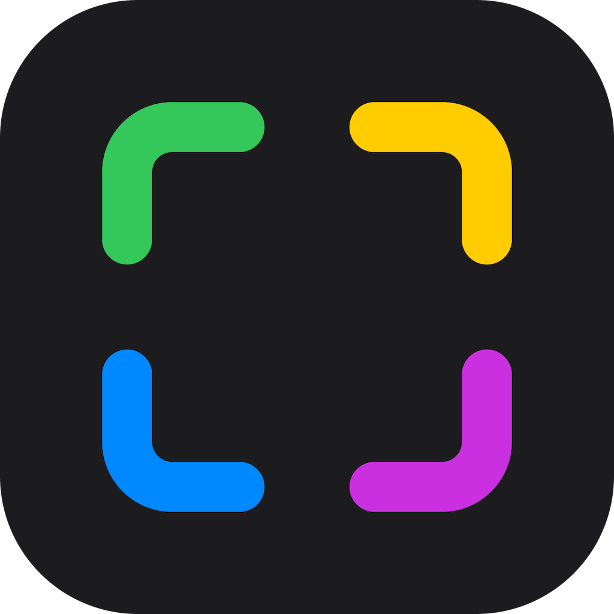
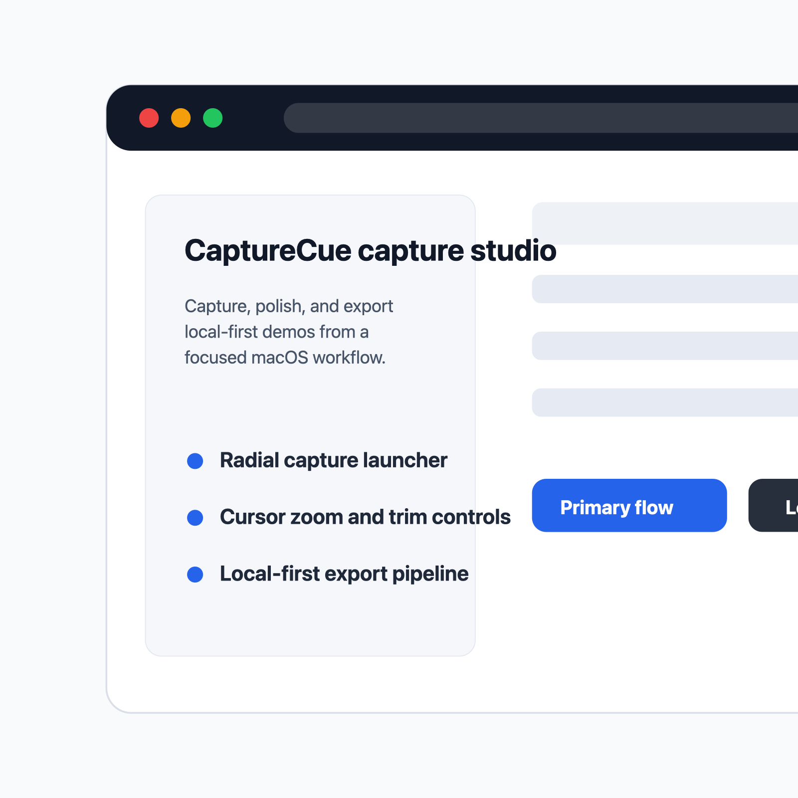

#

<p align="center">
  
</p>

<h1 align="center">CaptureCue</h1>

#### A minimal macOS capture studio for polished screenshots, demo videos, and GIFs.

  

[Key Features](#key-features) &bull; [How To Use](#how-to-use) &bull; [Download](#download) &bull; [Credits](#credits) &bull; [Related](#related) &bull; [Support](#support) &bull; [You may also like](#you-may-also-like) &bull; [License](#license)



## Key Features

- Fast capture launcher - Start screenshots, window captures, area captures, recordings, and GIF-oriented demo work from one focused macOS surface.
- Demo polish tools - Prepare shareable clips with cursor emphasis, trim controls, backgrounds, captions, camera, audio, and export settings.
- Screenshot utility layer - Fold annotation, redaction, numbered steps, copy, save, pin, and drag-out export into the same product direction.
- Local-first workflow - Keep recordings, screenshots, and project data on the Mac by default.

## How To Use

To build and run CaptureCue locally, use the checked-in Makefile:

```bash
make build
make dev
```

## Download

CaptureCue does not have a packaged public download yet. Build locally from source while the baseline is being rebuilt.

## Credits

- Reframed by Jan Kuri as the starting baseline.
- `NOTICE.md` and `LICENSE` for upstream attribution and license details.

## Related

- [MarkView](https://github.com/jonathan-arteaga/mark-view) - Markdown previews in Finder.
- [MouseKit](https://github.com/jonathan-arteaga/mouse-kit) - Mouse setup and DPI workflow utility.

## Support

Open an issue in this repository with the macOS version, capture mode, and a short reproduction path.

## You may also like

- [MarkView](https://github.com/jonathan-arteaga/mark-view)
- [SE VibeKit](https://github.com/jonathan-arteaga/se-vibe-kit)

## License

See `LICENSE`.

---

> [jonathanarteaga.com](https://jonathanarteaga.com) &nbsp;&middot;&nbsp; GitHub [@jonathan-arteaga](https://github.com/jonathan-arteaga)
